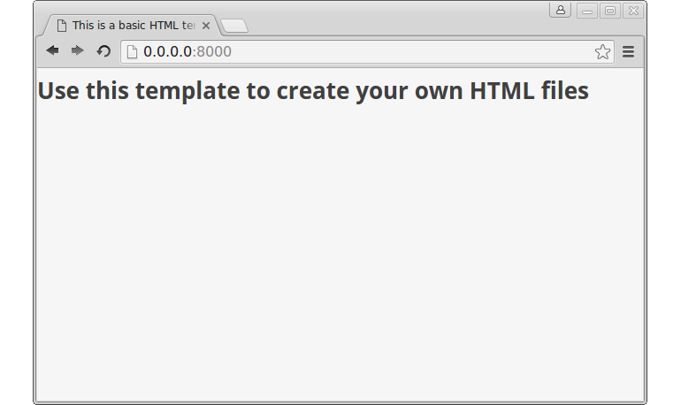

# Basic HTML file with Ext JS

We'll start the workshop with creating a simple HTML page and embed the
framework into it.

## Create basic HTML page

Basically we'll work with a single HTML file we'll extend gradually within each
section only. Our initial file will thereby only contain the basic HTML template
showing a heading. Let's create the file by the use of the (highly recommended)
text editor `atom`.

### Exercise

* Open the terminal and navigate to your workshop directory (if not already done)
  with:
```
$ cd ~/{{ book.extWorkshopFolderName }}
```
* Start the `atom` editor with the `{{ book.extWorkshopFolderName }}` directory
  as project:
```
$ atom .
```


Having `atom` opened we can create a new file by opening the context-menu on the
project folder `{{ book.extWorkshopFolderName }}` and selecting `New File`.

* Create a new file named `index.html` in the exercise directory and copy the
  content of the following basic HTML template into it
[include](../snippets/basic-template.html)
* Reopen the browser and (re-)load the URL {{ book.extWorkshopUrl }} to see the
  changes take effect:


## Include Ext JS

In the next step we'll insert two important lines into the `index.html` that
will automatically include the *full* ExtJS library into our basic HTML template.
The Ext JS code itself is also available online via `cdnjs`, so we don't
necessarily have to download the framework code to our local machine first. As
you will see in the next few steps, the (productive version of the) framework
consists of two files: Both a `CSS` (*Cascading Style Sheets*) and a `JS`
(*JavaScript*) file:

### Exercise

* Include the external files inside the end of your <code><head></code> element
  of your `index.html`:
[import](../snippets/include-ext-cdnjs.html)
* Again, reload the URL in the browser and keep track of the changes:



> **Note:** For this workshop it's satisfying to include the full builds of the
            framework and to always load them in the `head`. This technique
            allows us to basically forget about these resources for the course
            of the workshop. For a production website you would probably load
            the files in a different manor, and you would rather not load the
            versions of the libraries which contain everything. But the creation
            of specific versions of the base libraries that only include what
            your application actually needs, is way beyond the scope of this
            workshop.
