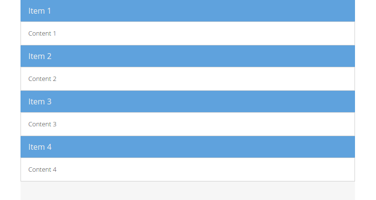

# Ext JS Viewport

In contrast to other JavaScript frameworks (e.g. jQuery) Ext JS is typically
used to serve as an integral framework that is used to build feature-rich single
page applications (SPA) and not as some kind of an "utility" or "helper"
framework for isolated challenges. Thus you would generally not use Ext JS to
integrate a single window (as created in the former section) in your existing
webapplication.

When developing an Ext JS application, (one of) the main components you're
dealing with, is the `Ext.container.Viewport`. The `Viewport` class represents a
specialized container that automatically resizes itself to the size of the
`document body` and therefore the viewable application area. Further on it
automatically resizes due to resizing the browser window and will perform sizing
and positioning on its child components as you can add other Ext JS UI components
and containers to it. How the positioning inside the `Viewport` takes place is
thereby configurable by a so called `Layout` (see [next chapter](../layouts/README.md)).

> *Note:* Given that the `Viewport` sizes to browser window, it's reasonable to
          have a **single** viewport per Ext JS application only.

In this section we're going create a simple viewport containing a set of nested
child components. This viewport will then act as the basic template for any
further exercise in this workshop.

## Exercise

* (Re-)open your `index.html` and replace the code creating the `Ext.window.Window`
  component with the following snippet
  [include](../snippets/viewport-simple.js)
* Reload the application page in the browser and you'll notice the first
  elementary indications of a simple full-screen webapplication (Try to resize
  the browser window!):

In the above example we used the method `Ext.create()` to instantiate the
component `Ext.container.Viewport` very similar to the previous example. The
result is a stack of four components composed of a `title` and a `html` value.
Per `defaults` we declare that each direct child component in the `Viewport` -
configured as `item` - should be rendered with a `bodyPadding` of 15 pixels
additionally.

## Exercise

* Use the Ext JS API documentation for the `Viewport` class ([here](http://docs.sencha.com/extjs/6.0/6.0.0-classic/#!/api/Ext.container.Viewport))
  to answer this question:
  > I created an Ext JS viewport with a couple of items without any specific
    configurations except `title` and `html`. At his juncture the `html`
    parameter includes a plenty of text content. Strangely I could not see any
    scrollbars, if the browser window gets resized. What is wrong here?
