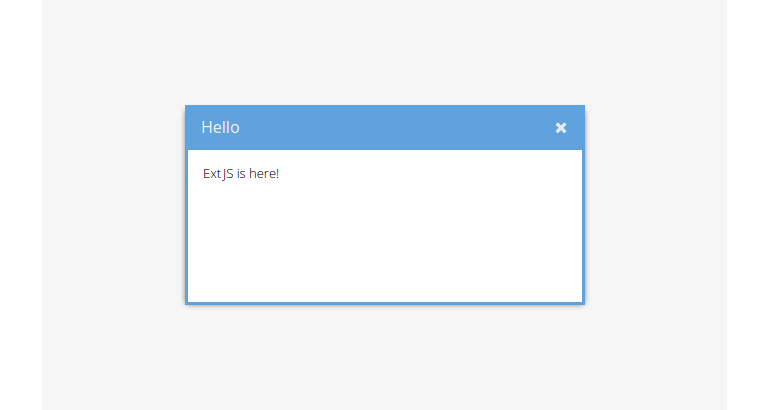

# Ext JS is here!

Having the last module finished, we have a simple HTML page without any real use
of the Ext JS framework present. We'll continue by creating a very simple Ext JS
component to verify the framework is ready to work with.

## Exercise

* (Re-)open your `index.html` and replace the <code>&lt;h1&gt;</code> element block
  within the <code>&lt;body&gt;</code> tag with the following <code>&lt;script&gt;</code> block:
[import](../snippets/open-window.html)
* Reload the page in the browser and look what's going to happen:

So, what have we done to create this simple Ext JS window?

The contents of the <code>&lt;script type="text/javascript"&gt;</code> tag will be interpreted as
JavaScript by the browser and any JavaScript code in it'll be run as soon as the
interpreter sees it.
In the next line we are finally going to *really* work with Ext JS. `Ext` is the
global namespace that encapsulates all classes, singletons and methods provided
by the framework. By calling it on the root scope (as the global singleton
object), we have access to the global methods provided by Ext JS. Here we execute
the method `onReady()` which has an anonymous function as argument. This
function is being processed as soon as the document is ready (but before the
document's `onload` listener and before images are loaded).

> **Hint** As already mentioned, the [Ext JS API documentation](http://docs.sencha.com/extjs/6.0/6.0.0-classic/)
           is quite substantial and really helpful while developing applications.
           Please take your time to get familiar with the documentation and
           start by inspecting the docs for the method `onReady()` used above
           by following this [link](http://docs.sencha.com/extjs/6.0/6.0.0-classic/#!/api/Ext-method-onReady).

In the anonymous function we pass to the `Ext.onReady()` method we execute - once
again on the Ext global object - the method `create()`. With the help of this
method we instantiate a Ext JS class (to be more specific: a subclass of
`Ext.Base`) by its full class name. Here we create the class `Ext.window.Window`,
which, as you may noticed, is a floating, resizable and draggable window
containing simple HTML text as content. Every component has a individual set of
configuration parameters (e.g. `title`), which are passed to the `create()`
method as the second parameter (and bunched in an object). And over again: See
the documentation for a full list of all available `Configs` for the
[window class](http://docs.sencha.com/extjs/6.0/6.0.0-classic/#!/api/Ext.window.Window).
