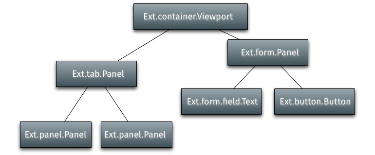

# Components

Components are referred to the Ext JS class `Ext.Component` which is the base
class for all components. Generally speaking a component itself is a predefined
Ext JS compatible module composed of HTML, CSS and JavaScript. In the former
exercises we already met the components `Ext.window.Window`, `Ext.container.Viewport`
and `Ext.panel.Panel` (whereas the latter not explicit, but it's the default
component in the `Viewport` container).

Every Component has a shorthand name called `xtype`. The xtype is especially
useful if you want to render your application lazily, that means rendering your
components at the time they're getting meaningful for your application, e.g.
creating an error message at the time an error occurred. In the upcoming examples
we'll use the `xtype` to create components.

A typical application's component hierarchy starts with a viewport at the top,
which has other containers and/or components nested within it.

In the upcoming section we're going to inspect some components that might be
useful for any Ext JS application your're going to develop in the future:

> *Note:* The descriptions given in the upcoming subsections are more or less
          derived from the [API documentation](http://docs.sencha.com/extjs/6.0/6.0.0-classic/#!/api/Ext.Component).

* [Panel](./panel.md)
* [Image](./image.md)
* [Form](./form.md)
* [Tree](./tree.md)
* [Grid](./grid.md)
