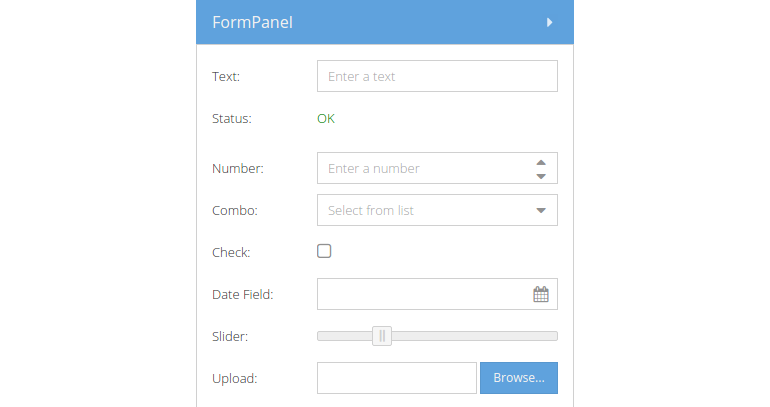
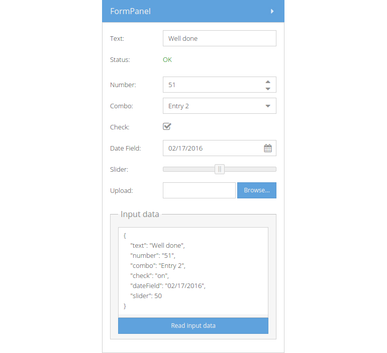

# Form Fields

The `Ext.form.Panel` presents a subclass of the panel and is especially useful
for building user interaction web forms and for saving and loading remote data.
Usually you combine a form panel with subclasses inherited from the
`Ext.field.Field` class. In the following example we'll get to know some of the
most important fields one would use in a form (listed with xtypes and links to
the API documentation):

* [textfield](http://docs.sencha.com/extjs/6.0/6.0.0-classic/#!/api/Ext.form.field.Text)
* [displayfield](http://docs.sencha.com/extjs/6.0/6.0.0-classic/#!/api/Ext.form.field.Display)
* [numberfield](http://docs.sencha.com/extjs/6.0/6.0.0-classic/#!/api/Ext.form.field.Number)
* [combobox](http://docs.sencha.com/extjs/6.0/6.0.0-classic/#!/api/Ext.form.field.ComboBox)
* [checkbox](http://docs.sencha.com/extjs/6.0/6.0.0-classic/#!/api/Ext.form.field.Checkbox)
* [datepicker](http://docs.sencha.com/extjs/6.0/6.0.0-classic/#!/api/Ext.picker.Date)
* [slider](http://docs.sencha.com/extjs/6.0/6.0.0-classic/#!/api/Ext.slider.Single)
* [filefield](http://docs.sencha.com/extjs/6.0/6.0.0-classic/#!/api/Ext.form.field.File)
* [button](http://docs.sencha.com/extjs/6.0/6.0.0-classic/#!/api/Ext.button.Button)

## Exercise

* (Re-)open your `index.html` and extend the panel in the viewport's east region
  by the following snippet:
[include](../snippets/component-form-fields.js)
* Reload the page in the browser and take a look at the result:



As stated above, the form is very useful if you want to systematically read out
values given by the user and to work with them afterwards, e.g. sending the
values to a server endpoint. In the next example we're going to create another
useful form component, the `Ext.form.FieldSet` class. The fieldset is a
specialized container for grouping fields. We we'll now create a fieldset with
a textarea and a button (ignore the `handler` method for the moment, we'll explain
events and component querying later on).

* Add the following fieldset to the lower end of the form field we declared above:
```javascript
{
    xtype: 'fieldset',
    title: 'Input data',
    layout: 'fit',
    items: [{
        xtype: 'textarea',
        height: 180,
        isFormField: false
    }, {
        xtype: 'button',
        text: 'Read input data',
        handler: function(btn) {
            var form = btn.up('form'),
                textArea = form.down('textarea');
            textArea.setValue(
                JSON.stringify(
                    form.getValues(), null, 4
                )
            );
        }
    }]
}
```
* Reload the page in the browser, enter some custom values in the form field and
  press the button `Read input data`:


