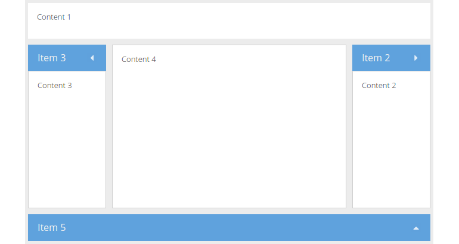

# Panel

A `Panel` is a container designed for building structured blocks for application
oriented user interfaces. Panels are, by their inheritance from
`Ext.container.Container`, capable of being configured with a layout (see
[previous chapter](../layouts/README.md)) and containing child components.
Panels also provide built-in collapsible, expandable and closable behavior and
can be easily dropped into any container or layout, whereas the layout and
rendering is completely managed by the framework.

In most applications the panel is one of the most often used components. In the
next exercise we'll extent our existing viewport by only a few configurations
and will see, that we have worked with panels (even we haven't specified it) yet.

## Exercise

* (Re-)open your `index.html` and extend the `Ext.container.Viewport` to match
  the following snippet:
[include](../snippets/component-panel.js)

As you may notice, it's hardly to spot any viewable difference to our previous
example. But have a look at the `defaults` attribute set in the viewport. It
contains a new key named `xtype` (remember: it's the shorthand name for a
component) with the value `panel`. Thus every direct child in the viewport will
be instantiated as a `panel`.

# Advanced panel configuration

A Panel may also contain bottom and top toolbars, along with separate header,
footer and body sections.

## Exercise

* (Re-)open your `index.html` and extend the panel rendered in the viewports
  center by the following snippet:
[include](../snippets/component-panel-toolbar.js)
* Reload the page in the browser and take a look at the result:

