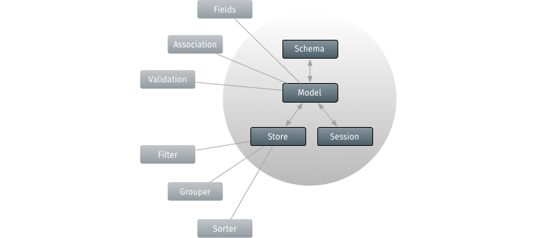

# Data

Now we've became acquainted with one of most important Ext JS visual components,
we're going to learn how one could load remote data into the existing
webapplication *without* reloading the page itself. For example this might be
interested for you if you want to implement a paging functionality to the
grid. In this context we'll get in touch with the Ext JS data package that is
responsible for loading (and saving) all of the data in the application. The
package consists of multiple classes, but there are three that are more important
than all the others: The `Ext.data.Model`, `Ext.data.Store` and `Ext.data.proxy.Proxy`
(sub-)classes.

In the forthcoming exercises we're going to recreate a gridpanel in the center
of our border layout that'll contain an `Ext.data.Store` reading remote data
with the use of an `Ext.data.proxy.Ajax` proxy. The store will be associated
with an `Ext.data.Model`.

* [Gridpanel](./grid.md)
* [Model](./model.md)
* [Proxy and store](./store.md)
