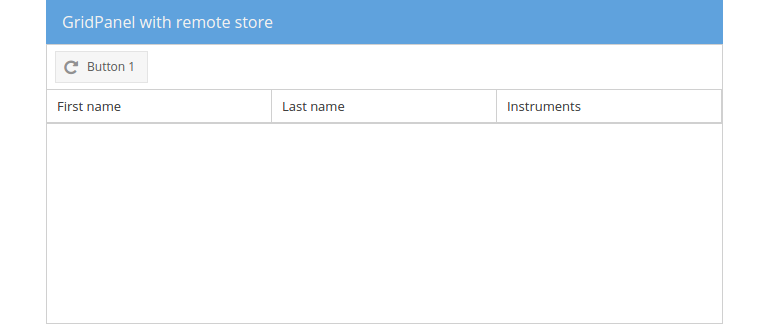

# Preparation

Let's start this section by creating another gridpanel in the center of our
border layout. Here we're going to replace the existing the panel with the
gridpanel by keeping the toolbar. The toolbar (and its button) will be needed
in the next module. The `columns` definition will stay unaffected in comparison
to the gridpanel we created in the recent exercise.

## Exercise

* (Re-)open your `index.html` and find the declaration of the center region.
* Replace the panel in the border layouts center with a grid, but leave the
  toolbar and set the store to null (for the moment).
  [include](../snippets/data-grid.js)
* Reload the page in the browser and verify the empty gridpanel in the layouts
  center:

