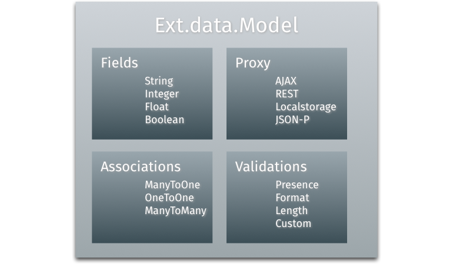

# Model

The core of the data package is the `Ext.data.Model` class. A Model or Entity
represents some object that your application manages, e.g. the (former) members
of a rock band. Models are used by stores, which are in turn used by many of the
data-bound components in Ext JS. The most significant parts (or properties) of a
model are `Fields` (they handle the members of a model), `Proxies` (they handle
the loading and saving of model data), `Validations` (they handle validation of
the data, e.g. if a field has not-null value) and `Associations` (they handle the
relations and linkages to other model instances).

In this exercise we'll build up a simple model, that'll contain some (string)
fields and simple validation for input data (ensuring that all fields have a
value). As we only have this single model we don't want to model any
associations. Please refer to the [API documentation](http://docs.sencha.com/extjs/6.0/6.0.0-classic/#!/api/Ext.data.Model)
for further details. You both have the possibility to assign the proxy in the
model or the store (using that model). Both ways do have advantages depending on
your application setup: If you set the proxy in the model it allows you to load
and save instances of this model without the need of a store and multiple stores
could use the same model. In contrast defining the proxy in the store it allows
you to use the same data model in multiple stores, even if the stores will load
their data from different sources. In this exercise we're going to set the proxy
in the store (without any specific reason).

## Exercise

* (Re-)open your `index.html` and insert the following code *before* the
  instantiation of the viewport (line ~15) to create a new model called
  `FormerMembers`:
[include](../snippets/data-model.js)
