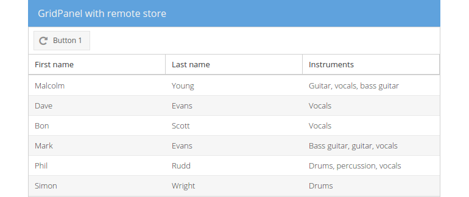

# Proxy and store

A store takes care of the client side caching of model objects and can be
configured to load data via a proxy. They provide different functions for
accessing the underlying model instances (e.g. sorting, filtering or querying).
To load and save instances a store uses a proxy. Generally speaking the data
source can be either local (client proxy) or remote (server proxy), whereas the
client proxies load/save their data locally and the server proxies load/save
their data by sending requests to a remote server.

In the following exercise we'll create a new `Ext.data.Store` reading data with
a `Ext.data.proxy.Ajax` from a remote source (The remote source is the python
server our simple webapplication lives on, but be aware that it could be any
other remote source).

## Exercise

* (Re-)open your `index.html` and insert the following code *after* the
  instantiation of the model `FormerMembers` (line ~34) to create the store.
  [include](../snippets/data-store.js)

If you would reload the page now, you wouldn't be able to see any changes in
the centered gridpanel as the newly created store isn't regarded as being
existent to the grid.

* Find the declaration of the gridpanel and update the `store` property to:
```javascript
store: 'formerMembers'
```
* Finally reload the page and view the results.


