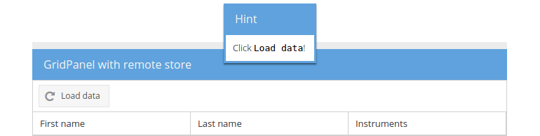

# Event `afterrender`

The `afterrender` event is being fired after a component is finally rendered
(to the DOM) and is very often used if you want to make sure, your listener
function is called *after* the component is rendered.

In the following exercise we'll register another `listener` to the button
`Load data` that will show up a minimalistic message box (`Ext.toast`) to the
user after the button has been rendered.

## Exercise

* (Re-)open your `index.html` and find the button declaration within the
  panel in the center region and we used in the former exercise.
* Register a listener for the event `afterrender` by appending the following
  code block to its `listeners` array:
[include](../snippets/event-afterrender.js)
* And again, reload the page in the browser and you will see the toast.



## Dissecting the example

Let's have a more detailed look at the function we passed to the `afterrender`
listener:

* ```javascript
function(cmp) {...}
```
As already illustrated, events can hold extra arguments which will be received
in the listener functions and similiar to the `click` event, the `afterrender`
event passes a reference to the rendered component to the anonymous function.
The variable `cmp` therefore refers to the button itself (but is not used in
our function).

* ```javascript
Ext.toast({
    html: 'Click <code>Load data</code>!',
    title: 'Hint',
    align: 't',
});
```
The `Ext.toast` class provides a lightweight, auto-dismissing pop-up
notifications and is configurable by the use of a configuration object. Here we
set both the `html` and `title` keys for a simple message and title as well as
the `align` key for specifing the alignment of the toast message to the top of
its anchor (the viewport).
