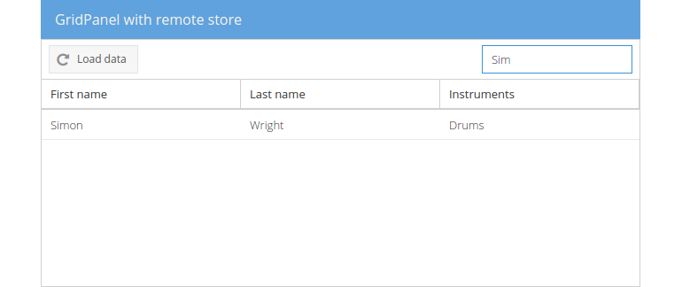

# Event `change`

The `change` event is being fired when e.g. a file input field's value has
changed.

In this (final) exercise we'll add a new textfield to the gridpanels toolbar
involving a filter function that is called on every change made by the user
to the textfield.

## Exercise

* (Re-)open your `index.html` and find the toolbar declaration inside the
  gridpanel rendered to the center region.

At first we will make use of the class `Ext.toolbar.Fill` to add a non-rendering
placeholder item to the toolbar whereby all following items will be aligned to
the right of the toolbar. (Other useful toolbar items you may interested in are
`tbseparator` and `tbspacer`.)

* Add the placeholder to the end of the toolbar by inserting the following
  declaration:
```javascript
{
    xtype: 'tbfill'
}
```
* Next we'll add a textfield with the `change` listener to the toolbar:
  [include](../snippets/event-change.js)
* Reload the page in the browser and you should notice a new textfield in the
  upper right of the centered gridpanel.


* Try out the newly created filter by loading data into the grid and changing
  the textfields value.



## Dissecting the example

Let's have a more detailed look at the function we passed to the `change`
listener:

* ```javascript
function(field, newValue, oldValue) {...}
```
If the value of a field is changed, our anonymous function is being called with
passed arguments `field`, `newValue` and `oldValue`. `field` holds a reference
to the textfield itself, `newValue` the changed/prevailing and `oldValue` the
original/preceding value.

* ```javascript
field.up('gridpanel').getStore()
```
Again, we use the methods `up()` to get a reference to the gridpanel and
`getStore()` to get the associated store (see [event click](./click.md) for the
detailed information).

* ```javascript
.filter({...})
```
With the store in hand we can access all methods provided by the (instantiated)
`Ext.data.Store` class. As we want to filter the store by a particular value
given in the textfield, we can make use of the method `filter()`. This method
filters the data in the store by one or more fields and can be configured with
a detailed filter configuration (from `Ext.util.Filter` class).

* ```javascript
{
    property: 'firstName',
    value: newValue || '',
    anyMatch: true,
    caseSensitive: false
}
```
The given object represents a filter that is applied to the `filter()` function
and is defined to filter the `property` (that is the field in the model to filter
on) <code>&#39;firstName&#39;</code>. The `value` to filter with is the `newValue` given by the
event or an empty string (<code>&#39;&#39;</code>) if the passed value is falsy (`false`, `0`, <code>&#39;&#39;</code>
`null`, `undefined` or `NaN`). Setting `anyMatch` to `true` configures the filter
to match the value characters at any position in the store's value and by having
`caseSensitive` set to `false` we ignore exact case matching.
