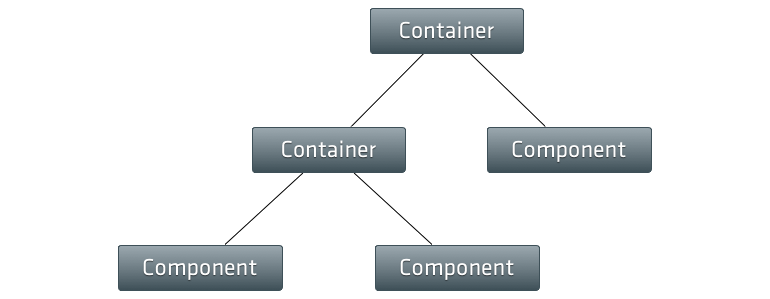

# Layouts

An Ext JS application (UI) is always made up of single components based on the
base class `Ext.Components`. The `Viewport` class we have seen in the previous
chapter is some kind of a special type of a component as it may contain other
components. Once Ext JS components are inserted into a superior container, its
layout properties must be defined (according to the requirement by your
application).

The `Layout` tells this superior container (e.g. the `Viewport`) how to properly
arrange its child components (e.g. `Panel`) in sizing and positioning. As you
may correctly note, the recent example we were using hasn't any specific layout
set, but could be rendered in the browser. This happens because the default
layout for all containers is the layout type `Auto` and this layout does not
specify any special positioning or sizing rules for child elements. It simply
renders the child items as normal block elements in the DOM.

Generally the layout of a `Container` has the be set via the `layout` configuration
attribute. In most cases it's satisfactory to set the name of the requested layout
as a simple string (e.g. <code>&#39;auto&#39;</code>) only, but there are layouts
available where a full object, specifying the layout options in more detail, are
allowed. Furthermore several layouts hold particular attributes related to the child
components of the container specifying e.g. it's inner position or size.

In this section we're going to have a quick look to some of the predefined
layouts Ext JS provides to us. Here we focus on the following layouts:

> **Note** The descriptions given in the upcoming subsections are based on the
           [API documentation](http://docs.sencha.com/extjs/6.0/6.0.0-classic/#!/api/Ext.layout.Layout).

* [Column](./column.md)
* [HBox](./hbox.md)
* [VBox](./vbox.md)
* [Accordion](./accordion.md)
* [Table](./table.md)
* [Border](./border.md)

For a full list of all layouts have a look at the [API documentation](http://docs.sencha.com/extjs/6.0/6.0.0-classic/#!/api/Ext.layout.Layout)
or the [Kitchen Sink](http://examples.sencha.com/extjs/6.0.0/examples/kitchensink/#layouts).
