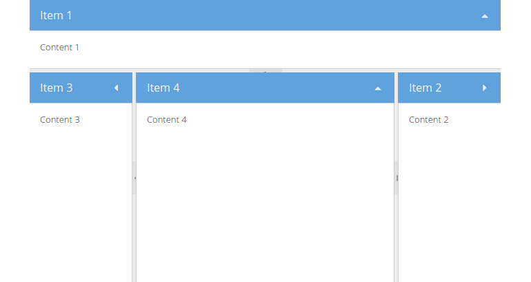

# Border

The `Border` layout is a multi-pane, application-oriented UI layout style that
supports multiple nested panels, automatic bars between `regions` and built-in
expanding and collapsing of `regions`.

When using this layout note, that any container using the border layout must
have a child item with <code>region:&#39;center&#39;</code>. This child item in
the center region will always be resized to fill the remaining space not used by
the other regions in the layout. Any child items with a region of `west` or
`east` may be configured with either an initial `width`, `flex` or an initial
percentage `width` value. Any child items with a region of `north` or `south`
may be configured with either an initial `height`, `flex` value or an initial
percentage `height` value.

## Exercise

* (Re-)open your `index.html` and update the code creating the `Ext.container.Viewport`
  component to match the following snippet:
  [include](../snippets/layout-border.js)
* Reload the page in the browser and take a look at the result:

