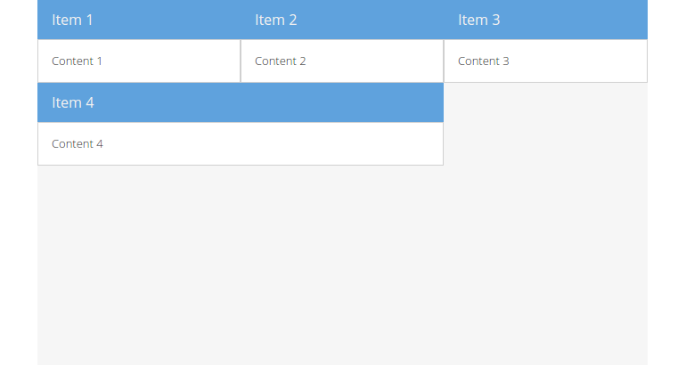

# Table

The `Table` layout allows you to easily render content into an HTML table. The
total number of columns can be specified, and `rowspan` and `colspan` can be
used to create complex layouts within the table.

In the case of `Table` layout, the only valid layout config properties are
`columns` and `tableAttrs`. However, the items added to a layout can supply the
config properties `rowspan` (the number of rows that the spanned cell needs to
cover), `colspan` (the number of cells that the cell should replace) and
`cellCls` (a CSS class name added to the table cell containing the item).

The basic concept of building up a `Table` layout is conceptually very similar
to building up a standard HTML table. You simply add each panel (or "cell") that
you want to include along with any span attributes specified as the special
config properties of `rowspan` and `colspan` which work exactly like their HTML
counterparts. Rather than explicitly creating and nesting rows and columns as
you would in HTML, you simply specify the total column count in the layout
config and start adding panels in their natural order from left to right, top
to bottom. The layout will automatically figure out, based on the column count,
rowspans and colspans, how to position each panel within the table.

> *Note:* Just like with HTML tables, your `rowspans` and `colspans` must add
          up correctly in your overall layout or you'll end up with missing
          and/or extra cells!

## Exercise

* (Re-)open your `index.html` and update the code creating the `Ext.container.Viewport`
  component to match the following snippet:
  [include](../snippets/layout-table.js)
* Reload the page in the browser and take a look at the result:

