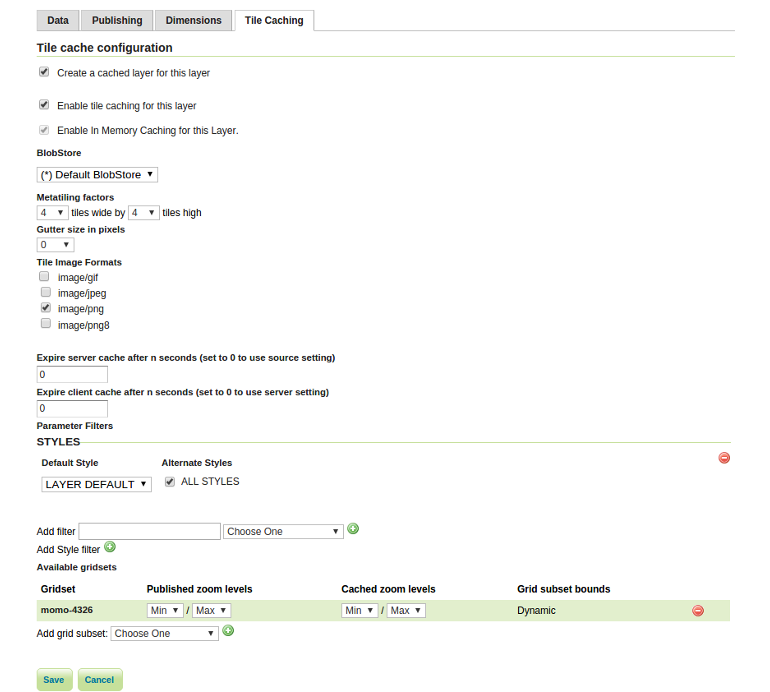

# Cached layer

In the next step we'll configure the layer `countries` to apply to all needed
cache-properties.

1. Go to `Data` &#10093; `Layers` and select the `countries` layer.
2. Open the panel `Tile Caching`.

Here we can configure all GWC-dependend properties in a per-layer-basis. The
most important configuration parameters are:

* *Create a cached layer for this layer*: Should this layer be cached?
* *Metatiling factors:* Metatiles are larger map tiles from which the cached tiles
  will be cut. The factor in this case indicates the size of the metatiles. A
  factor of **3x3** means that the screen width of the target tile is increased
  by a factor of three that results (by a requested tile size of 256px) in an
  metatile tile size of 768px. Primarily metatiles are needed to prevent
  duplicate map labels (for example for road layers) in two adjacent tiles.
* *Gutter size in pixels:* Additional frame (in px) to be requested by a tile.
  Only useful when there are layout problems in the preparation of labels and/or
  features on the tile edge in conjunction with the use of metatiles.
* *Tile Image Formats:* The standard image format for the tiles.
* *STYLES:* Is there any other style existing for the given layer that should be
  cached, it must be selected here. In most cases it will be sufficient to set
  the default layer styles (`LAYER DEFAULT`) only.
* *Gridset*: The gridset defines the grid the stored tiles are indexed and thus
  defines the spatial index of the individual tiles. The single tile in the
  rectangular grid is identified by means of a **x, y, z** coordinate triple. The
  **x and y** coordinates determine the horizontal and vertical position, the **z**
  coordinate the zoom level. See [previous chapter](./gridset.md) as well.

## Configure a cached layer

With this in mind, we can configure the layer `countries` as follows:

1. Select the following values:
  * *Create a cached layer for this layer:* checked
  * *Enable tile caching for this layer:* checked
  * *Metatiling factors:* 4 x 4
  * *Gutter size in pixels:* 0
  * *Tile Image Formats:* Check `image/png` only
  * *Expire server cache after n seconds:* 0
  * *Expire client cache after n seconds:* 0
  * *Styles:* Select `LAYER DEFAULT`
  * *Gridset:* Select `momo-4326` in the `Add grid subset` combobox and click the
    green plus icon. Remove any other preconfigured gridset by clicking the red
    minus icon.

2. Click `Save`.
