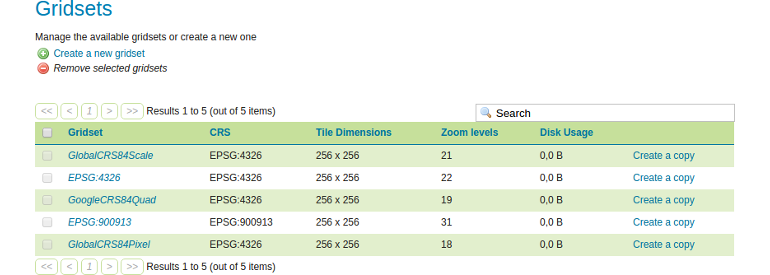
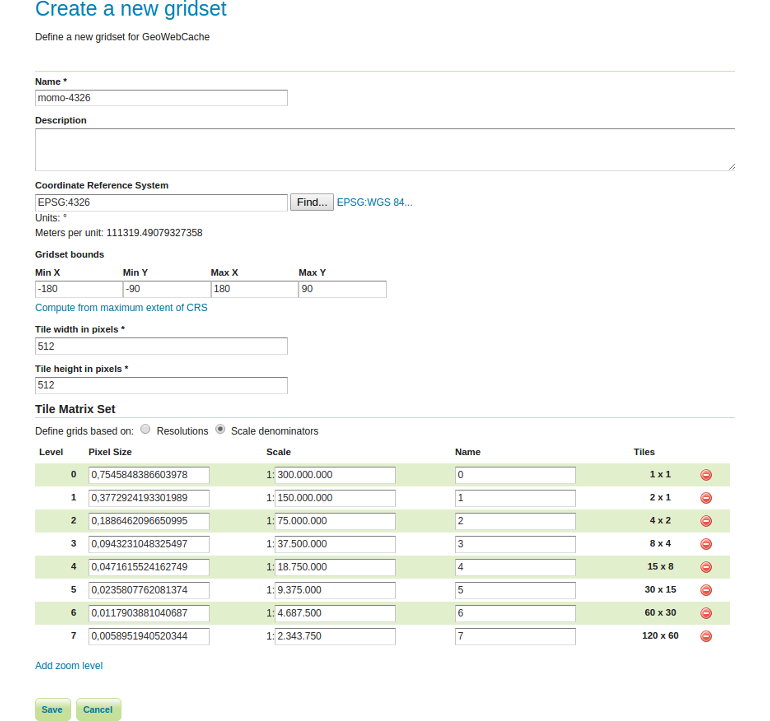

# Tiles and gridsets

## Tiles

GeoWebCache caches images retrieved from a WMS. The smallest unit of image
cached is known as a tile. All tiles are assumed to be the same dimensions and
are typically square (i.e. 256 pixels by 256 pixels). The tiles are stored in a
rectangular grid, indexed by (x,y) coordinates. A z coordinate (zero-indexed) is
used to denote the zoom level, resulting in each tile being indexed as a
triplet (x,y,z).

## Gridsets

Gridsets and gridsubsets refer to the spatial reference system of the layers
served by GeoWebCache. When GeoWebCache makes a request to a WMS, it uses the
gridset and gridsubset information to convert its internal tile index to a
spatial request that the WMS will understand.

A gridset is a global definition (i.e. not layer-specific) specifying:

* A spatial reference system.
* A bounding box describing the extent, typically the maximum extent for the
  above reference system.
* One of either a list of scale denominators, resolutions, or zoom levels.
* The tile dimensions in pixels (constant for all zoom levels).

A gridsubset is a layer-specific definition specifying:

* The gridset for the layer.
* (Optional) The bounding box for that layer (which must be a subset of the
  extent of the gridSet).
* (Optional) A list of zoom levels (which must be a subset of what is defined
  in the gridSet).

> **Note** For further instructions have a look at the source of the above
           explanations, [here](http://geowebcache.org/docs/1.6.0/concepts/index.html).

## Configure a new gridset

So, our first step will be to create a new gridset:

* Go to `Tile Caching` &#10093; `Gridsets`

* Click `Create a new gridset` to create a new gridset and use the following
   options for the creation:
   * *Name:* momo-4326
   * *Coordinate Reference System:* Use the find-button to select `EPSG:4326`
   * *Gridset bounds:* Click `Compute from maximum extent of CRS`
   * *Tile width in pixels:* 512
   * *Tile height in pixels:* 512
   * *Define grids based on:* Select `Scale denominators`
* Click `Add zoom level` to create a new zoom level. Enter the scale `300.000.000`
  and the name `0`.
* Once again click `Add zoom level`. You will see that the scale value is
  automatically cut into halves (`150.000.000`). Just enter the name `1` and
  repeat this step until you reached a total count of 8 zoom levels. The last
  scale value should be `2.343.750`.

* Click `Save`.
