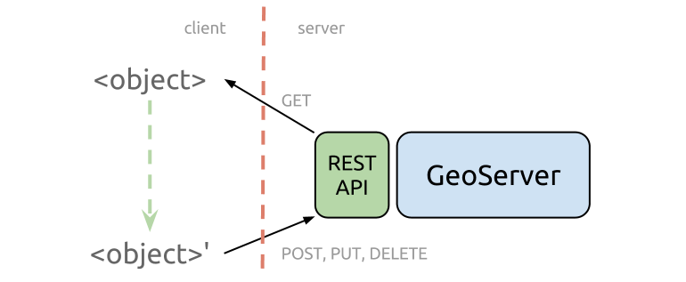

#Excursion: REST interface

This chapter will give you a short introduction to GeoServers REST (
Representational State Transfer) interface.
The REST API allows you to read, write, update and remove (almost) all GeoServer
catalog elements directly via the HTTP protocol. These can include, for example,
the manipulation of workspaces, data storages, layer styles and layers itself. A
benefit of using the REST interface is that you can script recurring steps of
work, for instance publishing a large number of layers at once from a remote
machine.

## What is REST?

**REST** (sometimes as **ReST**) is an acronym for Representational State Transfer
and is an architectural style for the realization of web services and is therefore
frequently mentioned in connection with **RESTful Webservices**. The idea behind
is that one should be able to use simple and lightweight HTTP calls to connect
between (web-)clients and remote servers.
So the capabilities of the REST API consists of the actions (verbs) we can use
to make HTTP requests combined with the configurable resources in GeoServer. For
each of the resources in GeoServer (workspaces, stores, layers, styles, layer
groups, etc.) we can perform the following operations ([source](https://en.wikipedia.org/wiki/Hypertext_Transfer_Protocol#Request_methods)):

| Operation | Description |
| --------- | ----------- |
| GET | The GET method requests a representation of the specified resource. Requests using GET should only retrieve data and should have no other effect. |
| POST | The POST method requests that the server accept the entity enclosed in the request as a new subordinate of the web resource identified by the URI. |
| PUT | The PUT method requests that the enclosed entity be stored under the supplied URI. If the URI refers to an already existing resource, it is modified; if the URI does not point to an existing resource, then the server can create the resource with that URI. |
| PATCH | The PATCH method applies partial modifications to a resource. |
| DELETE | The DELETE method deletes the specified resource. |
| HEAD | The HEAD method asks for a response identical to that of a GET request, but without the response body. This is useful for retrieving meta-information written in response headers, without having to transport the entire content. |
| OPTIONS | The OPTIONS method returns the HTTP methods that the server supports for the specified URL. |
| CONNECT | The CONNECT method converts the request connection to a transparent TCP/IP tunnel, usually to facilitate SSL-encrypted communication (HTTPS) through an unencrypted HTTP proxy. |
| TRACE | The TRACE method echoes the received request so that a client can see what (if any) changes or additions have been made by intermediate servers. |

To sum it up, in the GeoServer REST API we are able to use the methods as follows:

* GET to read an existing resource
* POST to add a new resource
* PUT to update an existing resource
* DELETE to remove a resource

In relation to the methods mentioned above each request will respond with a
certain response code:

| Status code | Status text | Description |
| ----------- | ----------- | ----------- |
| 200 | OK | Request was successful |
| 201 | Created | A resource (e.g. a layer) was successfully created |
| 403 | Forbidden | Not authorized  |
| 404 | Not Found | Resource or endpoint not found |
| 405 | Method Not Allowed | Wrong operation for resource or endpoint (e.g. GET-request, but only PUT/POST allowed) |
| 500 | Internal Server Error | Error while execution (e.g. syntax error in request) |
