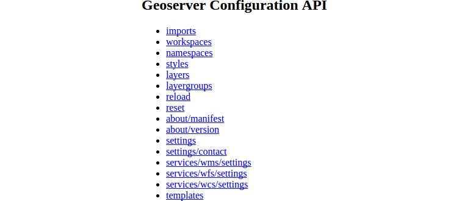

# Reading the catalog

In this module we will learn how to read out the GeoServer configuration via the
REST API.

As already mentioned in the previous chapter, a key condition of REST is the
addressability. Thereby each catalog configuration (= resource or endpoint) in
GeoServer has an unique URL.

At first we will investigate the REST API via the browser. At the same time we
are using the HTTP operation `GET` to *retrieve* information from the server.

* Open up a browser window and navigate to the following URL (Note: You will be
  prompted for your GeoServer user and password):
```
{{ book.geoServerBaseUrl }}/rest
```


You will see a simple HTML list which contains the top endpoints provided by the
REST API. The list view is fully controllable and clearly assigned. A selection
in the browser (for example the entry **workspaces**) navigates the browser to
unique URL <code>{{ book.geoServerBaseUrl }}/rest/workspaces</code>. The structure
of the list (when selecting a workspace) follows the logical structure of the
GeoServer catalog we already met in the previous sections:

```bash
workspace
  |
  +--datastore
       |
       +--featuretype
```

The above actions in the browser will call an endpoint in HTML format by default.
The GeoServer also supports the formats `JSON` (JavaScript Object Notation) and
`XML` (Extensible Markup Language), which are particularly relevant in the
manipulation of a resource we will use later on.

* Switch to a new tab in your browser. Then open and compare the following
  outputs:
```
{{ book.geoServerBaseUrl }}/rest/workspaces
```
```
{{ book.geoServerBaseUrl }}/rest/workspaces.json
```
```
{{ book.geoServerBaseUrl }}/rest/workspaces.xml
```

* In the next step we want to get a full description of the feature type
  `countries` we created in the previous module in format `JSON`. Copy the
  following request in your browser and explore the output:
```
{{ book.geoServerBaseUrl }}/rest/workspaces/momo/datastores/db_momo_ws/featuretypes/countries.json
```
