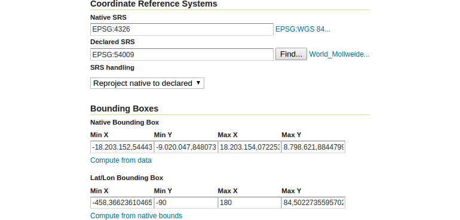

# Updating a layer

Basically we can change every element of catalog by the use of the REST API. In
the following example we will change the `countries_rest` layer's default output
projection to `EPSG:54009` ([Mollweide projection](https://en.wikipedia.org/wiki/Mollweide_projection)).

1. Execute the following terminal command to update the layer `countries_rest`.
   (Note: Every update needs the property `<enabled>true</enabled>` otherwise
   the catalog entry, in this case the layer, will be disabled and not be visible
   to any user!)
```bash
$ curl \
    -v \
    -u admin:momo-ws \
    -XPUT \
    -H "Content-type: text/xml" \
    -d "<featureType>
          <enabled>true</enabled>
          <srs>EPSG:54009</srs>
          <projectionPolicy>REPROJECT_TO_DECLARED</projectionPolicy>
        </featureType>" \
    {{ book.geoServerBaseUrl }}/rest/workspaces/momo-rest/datastores/db_momo_ws_rest/featuretypes/countries_rest
```
2. After this step has been confirmed as successfully finished with `HTTP / 1.1 200 OK`,
   we can then automatically calculate the new native and lat/lon bounding box
   of the layer by appending the parameter `recalculate=nativebbox,latlonbbox`
   to the REST URL:
```bash
$ curl \
    -v \
    -u admin:momo-ws \
    -XPUT \
    -H "Content-type: text/xml" \
    -d "<featureType>
          <enabled>true</enabled>
        </featureType>" \
    {{ book.geoServerBaseUrl }}/rest/workspaces/momo-rest/datastores/db_momo_ws_rest/featuretypes/countries_rest?recalculate=nativebbox,latlonbbox
```
3. Review that the layer has been updated correctly by opening the layer
   configuration in the GeoServer UI (`Data` &#10093; `Layers`) and have a look
   at the subsection `Coordinate Reference System` and `Bounding Boxes`, which
   should contain your requested changes.

4. Finally have a look at the layer preview page and note, that the default SRS
   is set to EPSG:54009.

