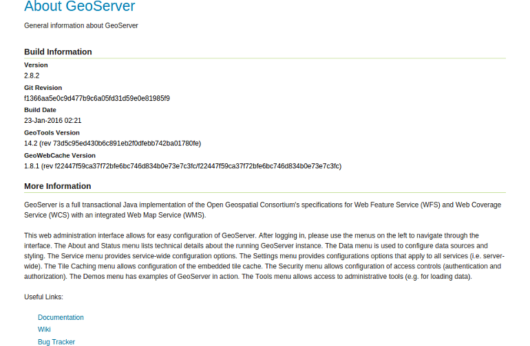

# About GeoServer

The about page lists general informations about the GeoServer you're running.
These listings are espacially helpful, if you want to contact any support or
if you want to know the installed GeoServer version for getting compatible
community modules and extensions.

*Note:* You'll see a link `Documentation` at the end of the page. This link will
guide you to the official documentation of the project and is a **very** helpful
address if you need any information about GeoServer.

## Exercise

* Follow the mentioned `Documentation` link and have a quick look around to
  see the valuable resources available here!
