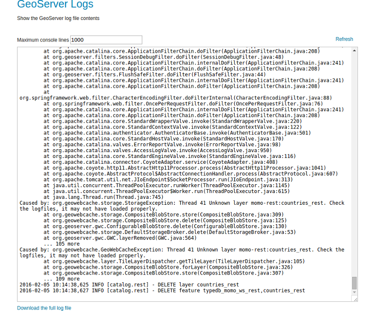

# GeoServer Logs

GeoServer displays the contents of the application logs directly through the web
interface. Reading the logs can be very helpful when troubleshooting. To view
the logs, click on `GeoServer Logs` on the left under <code>About & Status</code>.

## Exercise

1. Open up the `GeoServer Logs` section and investigate the last entries in
   your logfile. Can you find any conspicuous or interesting entry?
