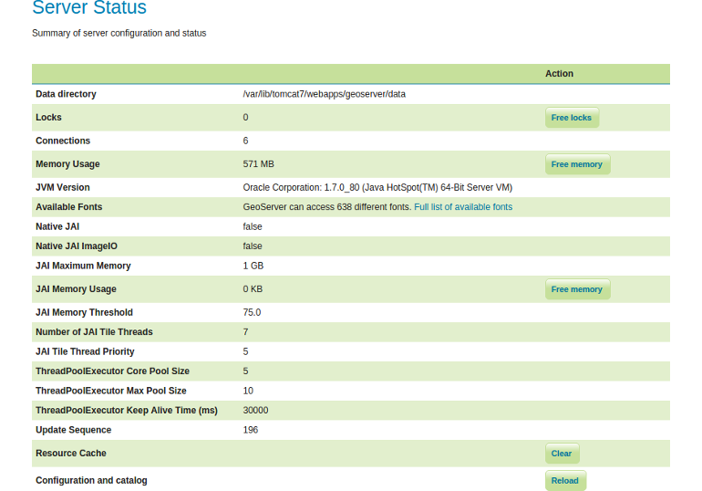

# Server Status

The Server Status page shows you many metainformation about the current GeoServer
configuration and overall status.

It provides a useful diagnostic tool in a testing and production environment and
should be your first place to go if are facing any problem with your running
GeoServer instance. *Note:* Certainly it's always useful to have a look at
the [Logs](./logs.md) additionally.

## Status indicators

The following table describes the current status indicators (as described
[here](http://docs.geoserver.org/latest/en/user/configuration/status.html#config-serverstatus)).

| Option | Description |
| ------ | ----------- |
| Data directory | The absolute path to your data directory. |
| Locks | A WFS has the ability to lock features to prevent more than one person from updating the feature at one time. If data is locked, edits can be performed by a single WFS editor. When the edits are posted, the locks are released and features can be edited by other WFS editors. A zero in the locks field means all locks are released. If locks is non-zero, then pressing `Free locks` releases all feature locks currently held by the server, and updates the field value to zero. |
| Connections | Refers to the numbers of vector stores, in the above case 6, that were able to connect. |
| Memory Usage | The amount of memory currently used by GeoServer. Clicking on the `Free Memory` button, cleans up memory marked for deletion by running the garbage collector. |
| JVM Version | Denotes which version of the JVM (Java Virtual Machine) is been used to power the server. |
| Available Fonts | A list of all fonts GeoServer has access to. These can be referenced in the layer style. |
| Native JAI | GeoServer uses Java Advanced Imaging (JAI) framework for image rendering and coverage manipulation. When properly installed (true), JAI makes WCS and WMS performance faster and more efficient. |
| Native JAI ImageIO | GeoServer uses JAI Image IO (JAI) framework for raster data loading and image encoding. When properly installed (true), JAI Image I/O makes WCS and WMS performance faster and more efficient. |
| JAI Maximum Memory | Expresses in bytes the amount of memory available for tile cache.
| JAI Memory Usage | Run-time amount of memory is used for the tile cache. Clicking on the `Free Memory` button, clears available JAI memory by running the tile cache flushing. |
| JAI Memory Threshold | Refers to the percentage, e.g. 75, of cache memory to retain during tile removal. JAI Memory Threshold value must be between 0.0 and 100.
| Number of JAI Tile Threads | The number of parallel threads used by to scheduler to handle tiles. |
| JAI Tile Thread Priority | Schedules the global tile scheduler priority. The priority value is defaults to 5, and must fall between 1 and 10. |
| ThreadPoolExecutor Core Pool Size | The imageMosaic reader may load, in parallel, different files that make up the mosaic by means of a ThreadPoolExecutor. A global ThreadPoolExecutor instance is shared by all the readers supporting and using concurrent reads. Here the current core pool size of the ThreadPoolExecutor is listed. |
| ThreadPoolExecutor Max Pool Size | Here the current maximum core pool size of the ThreadPoolExecutor is listed. |
| ThreadPoolExecutor Keep Alive Time (ms) | The time to be waited by the ThreadPoolExecutor before terminating an idle thread in case there are more threads than available in the core pool size. |
| Update Sequence | Refers to the number of times the server configuration has been modified. |
| Resource Cache | GeoServer does not cache data, but it does cache connection to stores, feature type definitions, external graphics, font definitions and CRS definitions as well. The `Clear` button forces those caches to empty and makes GeoServer reopen the stores and re-read image and font information, as well as the custom CRS definitions stored in `${GEOSERVER_DATA_DIR}/user_projections/epsg.properties`. |
| Configuration and catalog | GeoServer keeps in memory all of its configuration data. If for any reason that configuration information has become stale (e.g. an external utility has modified the configuration on disk) the `Reload` button will force GeoServer to reload all of its configuration from disk. |

## Exercise

1. Open up the `Server Status` page on your GeoServer and press the button
   `Free memory` besides `Memory Usage`. What do you observe?
