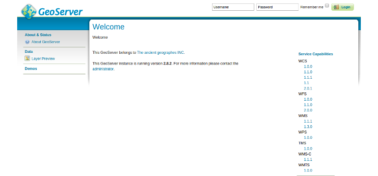
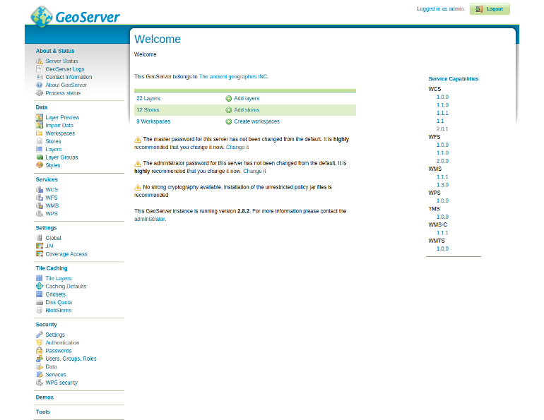

# Login and frontend overview

GeoServer includes a web-based administration interface. Most GeoServer
configuration can be done through this interface, without the need to edit
configuration files by hand or use an API. This section will give a brief
overview to the web interface. Subsequent sections will use the web interface in
greater detail.

## Welcome page

To open the GeoServer UI open the following address in your browser:

{{ book.geoServerBaseUrl }}

The initial page is called the `Welcome page`. To return to the Welcome page
from anywhere, just click the GeoServer logo in the top left corner of the page.

While the unauthenticated/anonymous Welcome page is not void of features, it
really just lets you see things (configured on geoserver) but not touch
them (and make configuration changes).

For security reasons, most GeoServer configuration tasks require you to be
logged in first. By default, the GeoServer administration credentials are
`admin` and `geoserver`, although this can and should be changed (see chapter
[Security](./security/README.md)).

## Login

Log in into GeoServer by using the default administration credentials from above.

After the login, many more options will be displayed.

## Basic layout

Use the links on the left side column to manage GeoServer, its services, data,
security settings and more. Also on the main page are direct links to the
capabilities documents for each service (WFS, WMS, WCS). We'll be using the
links on the left under `Data` - among them Layer Preview, Workspaces, Stores,
Layers, Layer Groups, and Styles - very often in this workshop, so it is good
to familiarize yourself with their location. Thus we'll start this module in the
following chapters by introducing the frontend structure.
