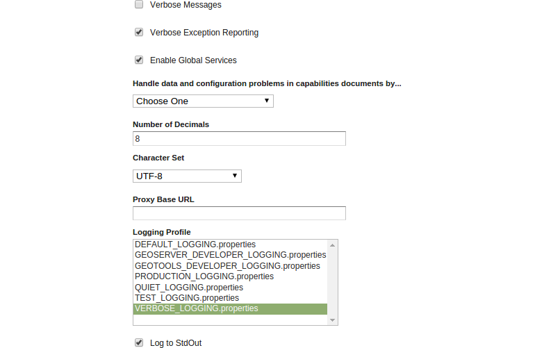
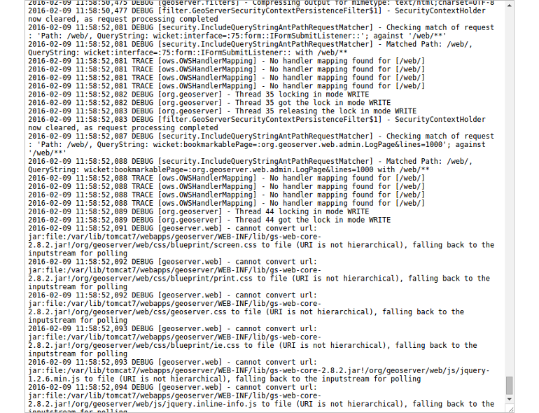

# Settings

The `Settings` section involves configuration settings that apply to the entire
server. Again, instead of explaining each checkbox, we'll focus on the most
important administration tools available in this section and its subsections.

For further instructions please have a look at the official GeoServer
[documentation](http://docs.geoserver.org/latest/en/user/webadmin/index.html#settings).

## Set handle data and configuration problems

This setting determines how GeoServer will respond when a layer becomes
inaccessible for some reason. By default, when a layer has an error (for example,
when the default style for the layer is deleted), a service exception is printed
as part of the capabilities document, making the document invalid. For clients
that rely on a valid capabilities document, this can effectively make a
GeoServer appear to be "offline". As administrator you may prefer to configure
GeoServer to simply omit the problem layer from the capabilities document, thus
retaining the document integrity and allowing clients to connect to other
published layers.

1. Go to `Settings` &#10093; `Global`.
2. Select `Skipping misconfigured layers` in the combo entitled with `Handle
data and configuration problems in capabilities documents by...`.

3. Click `Submit`.

## Reduce the number of decimals

To reduce the output size returned in a GetFeature response (and therefore
optimizing the bandwith) we can restrict the number of decimal places in a
GetFeature response. Here we will set the value to 2.

1. Go to `Settings` &#10093; `Global`.
2. Set `Number of Decimals` to 2.

3. Click `Submit`.

## Change logging level

At some point in your production (or development) usage of GeoServer you'll
encounter a problem where you'll need to get further and detailed informations
to find the cause of the problem. In this case you can increase the level of
logging. The following steps will guide you how to set the logging level to
a verbose-like level containing valuable informations about the image processing
process.

1. Go to `Settings` &#10093; `Global`.
2. Select the check box beside `Verbose Exception Reporting` to return service
   exceptions with full Java stack traces.
3. Find the description field entitled with `Logging Profile` and select the
   profile `VERBOSE_LOGGING.properties` to enable the DEBUG level logging on
   GeoTools and GeoServer.
   
4. Click `Submit`.
5. To validate the changes please open the OpenLayers layer preview for a layer
   of your choice (`Data` &#10093; `Layer Preview`) and zoom slightly into the
   map.
6. Go to <code>About & Status</code> &#10093; `GeoServer Logs` to open up the logfile and
   scroll down to the end of the file. Have a look at the timestamp and you'll
   notice plenty of logs for just a simple GetMap request (you did in the layer
   preview).
   
7. As the given settings are not really needed for the moment (we aren't facing
   any problems) we can reset the logging level to `DEFAULT_LOGGING.properties`.
