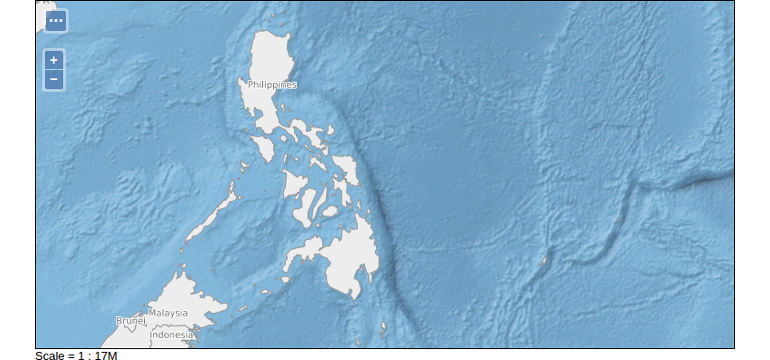

# Previewing a layer

You just published the group layer with GeoServer! Now let's see how it looks
by using the `Layer Preview`.

1. Navigate to `Data` &#10093; `Layer Preview`
2. Search for `world-layer`.
3. Click `OpenLayers`.

