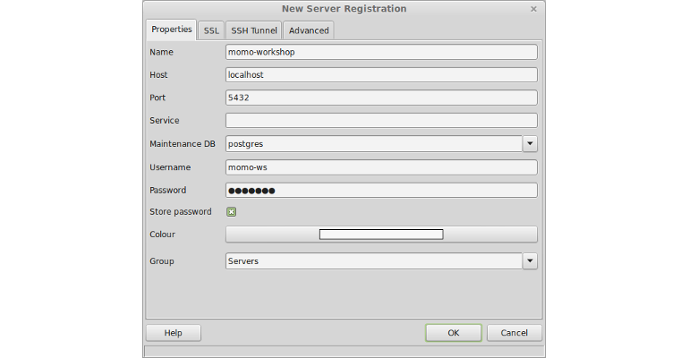

# Prerequisites

Before we can start importing and reading data in this modules, we have to create
a new database on the (already installed) PostgreSQL database server as data
source for new layers. Thus we will use the administration tool `pgAdmin III`.
Let's start by opening it:

1. Click `Menu` in the lower left corner and search for `pgadmin`
2. In the resulting list select `pgAdmin III` () to
   open the tool.

## Add a new server connection in pgAdmin

Once pgAdmin has started we can create a new connection to our PostgreSQL database
server:

1. Create a new server connection by selecting `File` &#10093; `Add Server` in
   the top menu bar and enter the following:
    * *Name:* momo-workshop
    * *Host:* localhost
    * *Port:* 5432
    * *Username:* momo-ws
    * *Password:* momo-ws
    * *Store password:* checked

2. Click `OK`

## Creating a database

Now we can connect to this server by a double click on the newly created entry
in the left hand sided `Object browser` (or open the context menu for this entry
and select `Connect` as shown below).


Within the next steps we will create a new database on this database server:

1. Open the SQL-Query window by clicking the icon
 in the upper toolbar. Note:
If the icon is greyed out, select the existing database `postgres` first.
2. Copy the following SQL block into the SQL-Query window:
```sql
CREATE DATABASE db_momo_ws
    WITH OWNER = momo-ws
    ENCODING = 'UTF8'
    TABLESPACE = pg_default
    CONNECTION LIMIT = -1;
```
3. Click `Execute query` () in the upper
   toolbar to run the query.
4. After successful execution go back to the `Object browser`, select the server
   and refresh the actual view (by pressing `Refresh the selected object`
   () in the top toolbar) and ensure
   you have a new database entry named `db_momo_ws` present.
5. Close the SQL-Query window.

## Creating a schema

Once the database is created, we'll create a new schema in this database. This
schema will be used to store any geodata table we are going to import in this
workshop.

1. Select the newly created database `db_momo_ws` in the `Object browser` and
   open the SQL window (). If you
   haven't closed the SQL-Query window before, please verify that you are
   connected to the correct database in the upper toolbar. Otherwise all
   subsequent SQL queries will be executed on the wrong database!
2. Copy the following SQL block into the SQL-Query window to create a new schema
   named `geodata`:
```sql
CREATE SCHEMA geodata
    AUTHORIZATION momo-ws;
```
3. Click `Execute query` () to run the query.
4. Refresh the `Object browser` and ensure the new schema is being created in
   the database `db_momo_ws`.

## Enable spatial functionality

In the final step we will add support for geographic objects by enabling the
spatial database extension PostGIS for our database `db_momo_ws`.

1. Open the SQL window (if not already opened) and paste in the following SQL
   block to spatially enable the database `db_momo_ws`:
```sql
CREATE EXTENSION postgis;
```
2. Click `Execute query` to run the query.
3. Ensure the extension is being successfully installed by executing the
   following query:
```sql
SELECT PostGIS_full_version();
```
   The corresponding output should look like:
```sql
   "POSTGIS="2.1.2 r12389" GEOS="3.4.2-CAPI-1.8.2 r3921" PROJ="Rel. 4.8.0, 6 March 2012" GDAL="GDAL 1.10.1, released 2013/08/26" LIBXML="2.9.1" LIBJSON="UNKNOWN" RASTER"
```
