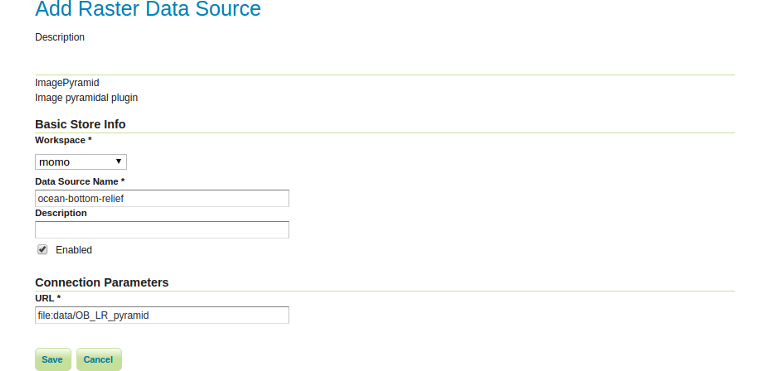

# Creating a new store

1. Go to `Data` &#10093; `Stores` &#10093; `Add a new Store`
2. Select `ImagePyramid`

3. Create the new store as follows:
    * *Workspace:* momo
    * *Data Source name:* ocean-bottom-relief
    * *Enabled:* checked
    * *URL:* `file:data/OB_LR_pyramid`

4. Click `Save`.
