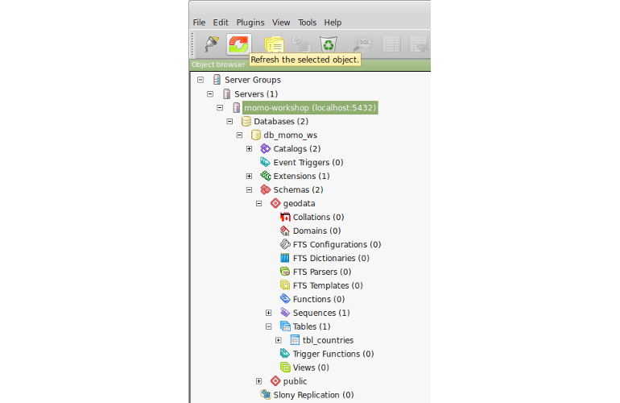

# Import

Our workshop data (see [here](../../../../overview/data.md)) is actually given as a
collection of single shapefiles. In order to enhance the performance while
read and write processes and enable writing at all (shapefiles can't be
manipulated via WFS-T after they have been published), we will import the
given data into our own PostgreSQL database entity we just created.

# Import country polygons

* Open a new terminal window and navigate to the materials directory:
```
$ cd ~/materials
```
* List all directories in the current folder with:
```
$ ls -l
```
* You should be able to see the folders `natural_earth` and `osm_mongolia`. If
  you inspect them further on, you will see that each folder contains a wide list
  of single shapefiles, but for the moment we want to use a small portion of
  them to import into the database only. Therefore we are going to start with
  importing a shapefile involving worldwide country polygons.
* Navigate to directory `materials/natural_earth/10m_cultural` and check if you
  can find a file named `ne_10m_admin_0_countries.shp`.
* To import the shapefile we will use the command line tool `shp2pgsql`. The
  following command will transform the input shapefile `ne_10m_admin_0_countries.shp`
  with the input encoding `LATIN1` and input projection `4326` to a SQL statement
  which will fill the data in a new table `tbl_countries` in schema `geodata`.
  After execution the output of `shp2pgsql` is directly piped to `psql` which
  will run the SQL output against the workshop database. You can easily copy
  the command below into the terminal window and execute it subsequently.
```
$ shp2pgsql \
    -s 4326 \
    -W LATIN1 \
    -I ne_10m_admin_0_countries.shp \
    geodata.tbl_countries | \
  psql \
    -h localhost \
    -p 5432 \
    -U momo \
    -W \
    -d db_momo_ws
```
* After the successful execution of the above command (re-)open `pgAdmin III`,
  mark the database server `momo-workshop` in tree view and click
  `Refresh the selected object` to refresh the database/table list and expand
  the tree to `Databases` &#10093; `db_momo_ws` &#10093; `Schemas` &#10093;
  `geodata` &#10093; `Tables` (if not already happened) as shown below:



* Select table `tbl_countries` and click `View the data in the selected object`
  to open the data view for the imported table as shown below:


* Congratulations! You've successfully imported a shapefile into PostgreSQL
  that can now easily be published through the GeoServer instance! :thumbsup:
