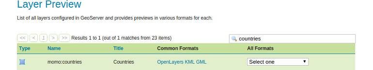
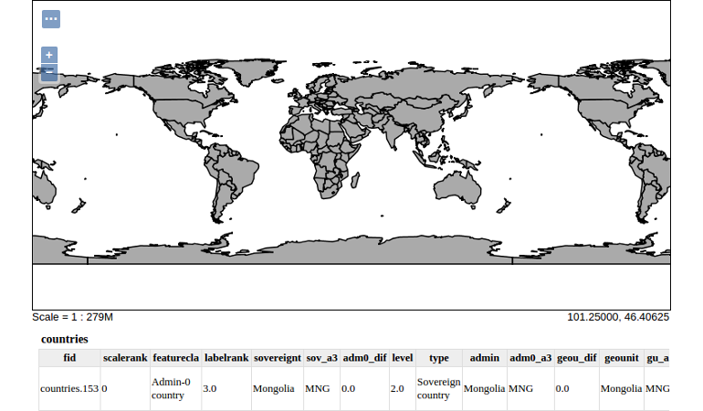
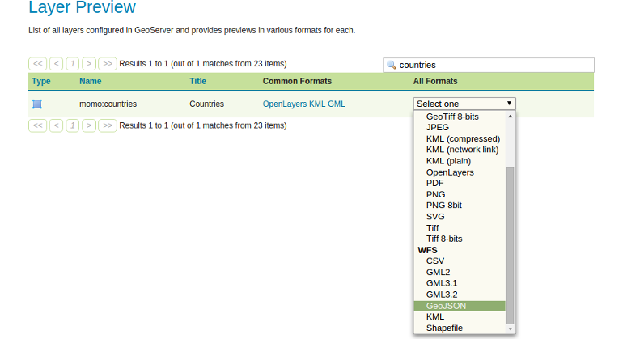

# Previewing a layer

You just published the layer with GeoServer! Now let's see how it looks by using
the `Layer Preview`.

* Navigate to `Data` &#10093; `Layer Preview`
* Search for `countries`.
* Click `OpenLayers`.





As you published the layer `countries` GeoServer not only serves this layer as
WMS, in addition it automatically publishes the feature type via its WFS server.

* Return to the `Layer Preview` site and search for `countries` (see steps 1.
  and 2. ahead).
* Select a WFS format (e.g. the common format `GeoJSON`) in the dropdown
  menu `All formats`.

  

After selecting the entry you should see a new browser tab or window containing
the GeoJSON representation of the layer `countries` similar to following excerpt:

```javascript
{
    "type": "FeatureCollection",
    "totalFeatures": 254,
    "features": [{
        "type": "Feature",
        "id": "countries.1",
        "geometry": {
            "type": "MultiPolygon",
            "coordinates": [
               [
                   [
                       [-69.99693762899994, 12.577582098000022],
                       [-69.93639075399997, 12.531724351000037],
                       [-69.92467200399997, 12.519232489000018],
                        (...)
                    ]
                ]
            ]
        },
        "geometry_name": "geom",
        "properties": {
            "scalerank": 3,
            "featurecla": "Admin-0 country",
            "labelrank": 5,
            "sovereignt": "Netherlands",
            (...)
        }
    },
    (...)
    ]
};
```
