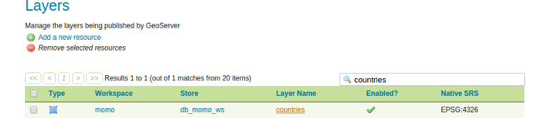

# Style

A style is a visualization directive for rendering geographic data. A style can
contain rules for color, shape, and size, along with logic for styling certain
features or points in certain ways based on attributes or scale level.

Every layer must be associated with at least one style. GeoServer recognizes
styles in Styled Layer Descriptor (SLD) format. The Styling section will go into
this topic in greater detail.

## Create and assign a style to a layer

1. Go to `Data` &#10093; `Styles` &#10093; `Add a new style`
2. Create a new style as follows:
    * *Name:* countries
    * *Workspace:* momo
    * *Format:* SLD
    * Copy and paste the following SLD content into the style field:
```xml
<?xml version="1.0" encoding="UTF-8"?>
<sld:StyledLayerDescriptor
    xmlns="http://www.opengis.net/sld"
    xmlns:sld="http://www.opengis.net/sld"
    xmlns:ogc="http://www.opengis.net/ogc"
    xmlns:gml="http://www.opengis.net/gml"
    version="1.0.0">
    <sld:NamedLayer>
        <sld:Name>countries</sld:Name>
        <sld:UserStyle>
            <sld:Name>Countries</sld:Name>
            <sld:Title>Countries</sld:Title>
            <sld:FeatureTypeStyle>
                <sld:Name>countries</sld:Name>
                <sld:Rule>
                    <sld:PolygonSymbolizer>
                        <sld:Fill>
                            <sld:CssParameter name="fill">#EDEDED</sld:CssParameter>
                        </sld:Fill>
                        <sld:Stroke>
                            <sld:CssParameter name="stroke">#969696</sld:CssParameter>
                            <sld:CssParameter name="stroke-width">0.5</sld:CssParameter>
                        </sld:Stroke>
                    </sld:PolygonSymbolizer>
                    <sld:TextSymbolizer>
                        <sld:Label>
                            <ogc:PropertyName>name</ogc:PropertyName>
                        </sld:Label>
                        <sld:Font>
                            <CssParameter name="font-family">DejaVu Sans</CssParameter>
                            <CssParameter name="font-size">10</CssParameter>
                        </sld:Font>
                        <sld:LabelPlacement>
                            <sld:PointPlacement>
                                <sld:AnchorPoint>
                                    <sld:AnchorPointX>0.5</sld:AnchorPointX>
                                    <sld:AnchorPointY>0.5</sld:AnchorPointY>
                                </sld:AnchorPoint>
                            </sld:PointPlacement>
                        </sld:LabelPlacement>
                        <sld:Halo>
                            <sld:Radius>1</sld:Radius>
                            <sld:Fill>
                                <CssParameter name="fill">#FFFFFF</CssParameter>
                            </sld:Fill>
                        </sld:Halo>
                        <sld:Fill>
                            <CssParameter name="fill">#707070</CssParameter>
                        </sld:Fill>
                    </sld:TextSymbolizer>
                </sld:Rule>
            </sld:FeatureTypeStyle>
        </sld:UserStyle>
    </sld:NamedLayer>
</sld:StyledLayerDescriptor>
```

3. Go to `Data` &#10093; `Layers`, search for `countries` and select it in the list.



4. Go to tab `Publishing`.


5. Select `momo:countries` in dropdown list `Default Style`.


6. Click `Save`.
7. Open the layer preview for the layer `countries` and you will see that the
   layer will have a new appearance (light grey polygon fill) including labels
   for each country.


