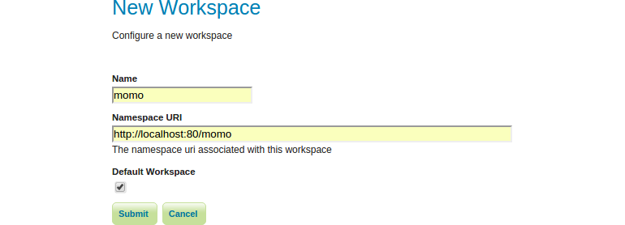

# Workspace

A workspace (sometimes referred to as a namespace) is the name for a notional
container for grouping similar data together. It is designed to be a separate,
isolated space relating to a certain project. Using workspaces, it is possible
to use layers with identical names without conflicts.

Workspaces are usually denoted by a prefix to a layer name or store name. For
example, a layer called streets with a workspace prefix called nyc would be
referred to by nyc:streets. This would not conflict with another layer called
streets in another workspace called dc (dc:streets).

Stores and layers must all have an associated workspace. Styles may optionally
be associated with a workspace, but can also be global.

Technically, the name of a workspace is a URI, not the short prefix. A URI is a
Uniform Resource Identifier, which is similar to a URL, but does not need to
resolve to a web site. In the above example, the full workspace could have
been http://nyc in which case the full layer name would be http://nyc:streets.
GeoServer intelligently replaces the workspace prefix with the full workspace
URI, but it can be useful to know the difference.

## Creating a new workspace

In this section we are going to create a new workspace called `momo`.

1. Navigate to `Data` &#10093; `Workspaces`.
2. Click `Add new workspace` and enter the following:
    * *Name:* momo
    * *Namespace URI:* http://localhost:80/momo
    * *Default Workspace:* checked
3. Click `Submit`

The workspace has been created and is now active. The green check mark indicates
that the workspace is the default.
